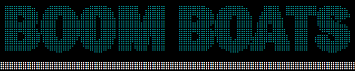
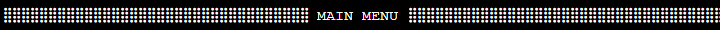
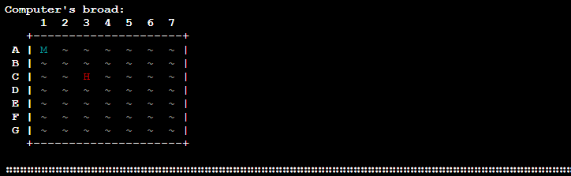

---------------------------------------------------------------------------------------------------------------------
# Boom Boats - Battleship game

Boom Boats is a battleship game moddeled after the classic board game and is played through Heroku in a mock-terminal. The goal is to sink all 5 enemy ships before they are able to sink yours. The player scores points base don accuracy and wether or not they are victorious. The game is played by providing two coordinate (a row and column) for a strike.

* The deployed website of <a href="https://wouter-it.github.io/Riddle-me-this/" target="_blank">*Boom Boats*</a> on Heroku.

# Contents
- [User Experience UX](<#user-experience-ux>)
  - [Wireframes](<#wireframes>)
  - [Logic flow](<#logic-flow>)
  - [Design & Colour Scheme](<#design--colour-scheme>)
    - [ASCII art](<#ascii-art>)
    - [Colour Palatte](<#colour-palette>)
- [Features](<#features>)
  - [Current Features](<#current-features>)  
    - [Intro logo](<#intro-logo>)
    - [Main menu](<#main-menu>)
    - [Quit game](<#quit-game>)
    - [Leaderboards](<#leaderboards>)
    - [Rules](<#rules>)
    - [Play Game](<#play-game>)
    - [Game board](<#game-board>)
    - [Error feedback](<#error-feedback>)
  - [Future Features](<#future-features>)
- [Technologies & Tools used](<#technologies--tools-used>)
- [Testing](<#testing>)
- [Deployment](<#deployment>)
  - [How to deploy the project yourself](<#how-to-deploy-the-project-yourself>)
  - [Copy repo to GitHub](<#to-copy-the-repository-in-github>)
  - [Create local clone](<#to-create-a-local-clone-of-this-project>)
- [Credits](<#credits>)
  - [Content](<#content>)
- [Acknowledgements](<#acknowledgements>)

# User Experience UX

## Wireframes

The Wireframes for Boom Boats were made using [Figma](https://www.figma.com/) due to similar reasons as in the previous milestone project Riddle me This: familiarity and experience that has been built up with Figma over the past months. There are wireframes are relatively simple due to the fact the application runs in a mock-terminal and is therefore rather limited in design options. Nevertheless, the wireframes did provide a rough sketch on how the artwork for the game would be arranged on the screen. The final design of the game varies from the Figma wireframes in some regards as during the process I became more aware of the exact limitations and complexities of arranging art in the mock-terminal. I adjusted my designs accordingly without updating the wireframes.

## Logic flow

In addition to the wireframes a flowchart was made to clearly map out the flow of the programme. The aim of this flowchart was to capture the top-level processes of the game as well as to illustrate the process a player goes through in order to play the game. The flowchart was made using [Lucid Chart](https://www.lucidchart.com/)

[Back to top](<#contents>)

## Design & Colour Scheme

### ASCII art
Boom Boats utilises ASCII art in order to add brand identity and supportive visual feedback to the game and player. The art is kept relatively simple due to the limitations of art in a terminal and as not to draw attention away from the core gameplay. The art was generated using [Twitch Quotes](https://www.twitchquotes.com/ascii-art-generator).

[Back to top](<#contents>) 

### Colour Palette

In addition to ASCII art, color is added through the use of the [Colorama module](https://pypi.org/project/colorama/) to further establlish game-brand identity and help guide the player through the game with visual feedback. The addition of colour and style to the text greatly improves the overall readibility of the game's UI. The use of color was first seen in a [fellow students 3rd milestone project 'Fury' by kpetrauskas92](https://github.com/kpetrauskas92/fury-p3/blob/main/README.md) and is therefore creditted in the code.

The colors are declared in the file in full capital letters to indicate these variables should not be changed.

Cyan was used as the main color for the logo in order to enhance the "naval" theme of the game.

The use of DIM to darken out the sea tiles, Cyan to mark missed shots 'M', red to mark hit shots 'H', green to mark player ships 'S' and UI elements that provide supportive information.

[Back to top](<#contents>)

# Features

## Current Features

### Intro Logo 
- When the game boots the player is greeted with the Boom Boats logo in ASCII art and Cyan blue color. (ASCII art and the use of Colour is repeated on every screen, for the sake of reducing reptitiveness will not be mentioned again.)
- Greets the player immersively as if they are an admiral commanding a fleet.
- Countdown indicates the game is loading and will start shortly.
- Employs a typewriter effect to give the impression the text is being typed/said to the player.

[Back to top](<#contents>)

### Main menu
- Upon loading the game opens into the main menu from where the player can navigate using 4 different options which will be elaborated upon below.
- Includes banner to indicate the user is currently in the main menu.
- Contains the logo of Boom Boats in text.
- Provides feedback as to what is expected of the user. (Repetitive feature, will not be mentioned again.)

[Back to top](<#contents>)

### Quit game
- Allows the user to temrinate the game.
- Asks for confirmation to prevent a shutdown happening unintentionally.

[Back to top](<#contents>)

### Leaderboards
- A real-time leaderboards attached to a Google Spread Sheet through an API.
- Updates automatically after a run is complete.
- Clearly indicates position, username and score of the players in the leaderboards.
- Displays the top 10 players from the leaderboards spreadsheet.

[Back to top](<#contents>)

### Rules
- Displays the rules of the game.
- Explains how a user can score points and what the core goal of the game is.
- Explains the bonus system,

[Back to top](<#contents>)

### Play Game
- First verifies if the user wants to view the rules to prevent a player from accidentaliy starting a game without knowledge of the rules.
- If they choose to view the rules, the game automatically progresses them to the registration page upon pressing "Enter".

- Requests a username from the player.
- Information is stored and used to register their score to the leaderboards.
- Also used to provide customisation to the game board on the next screen.

[Back to top](<#contents>)

### Game board
The main game screen where the core gameplay loop takes place. It consists of several elements that support the player during their gameplay, providing information has they go.

**UI value**
- Computer board displays the board the player is shooting at.
- Provides visual feedback in style and color to make it easy to read.
- Provides information on where the player has already shot.

**Gameplay value value**
- Makes it significantly easier to keep track.
- Speeds up the process of making decisions.
- Row and column headers (1 through 7, A through G) make it easy for the player to select a target.

**UI value**
- User board displays the board of the player.
- Shows where the player's ships are placed.
- Provides information on where the computer has already shot.

**Gameplay value value**
- Makes it significantly easier to keep track of player board state.
- Enhances sense of pressure when many player ships have already been sunk.

**UI value**
- Informative UI elements that provide informaiton to the player.
- Display how many computer/player ships are left.
- Displays score and turncount to keep track of player performance.

**Gameplay value value**
- Allows player to easily keep track of their current run performance.
- Player can abandon a run if the score isn't on par with their personal best.

**UI value**
- Supportive text to guide player through the strike coordinate selection process.

**Gameplay value value**
- Speeds up the strike selection process.

**UI value**
- Feedback with a short delay between messages to build suspense and provide information on the strike results.

**UI value**
- Computer turn feedback with a short delay between messages to simulate that the computer is "Thinking"
- Clearly states the coordinates chose by the computer for a strike, and provide feedback if the strike was hit or miss.

**UI value**
- Upon completeing the game a message is displayed to tell the player they won or lost.
- Visually present to draw attention.
- Explains the bonus points earned.

**Gameplay value value**
- Informs the player a run has been completed.

**UI value**
- Clearly state that the score is uploaded to the leaderboard.
- Asks the player if they want to play again without having to go through the menu.
- Allows player to return to menu.

**Gameplay value value**
- Speeds up the process to restart a run significantly.

[Back to top](<#contents>)

### Error feedback
- Each input request provides an error with explanatory text to tell the user what went wrong.
- Error messages are deleted after a short period to keep the UI clean.
- Error messages are bold and red to draw the player's focus.

## Future Features
- Ability login so a user can protect their username and use it explusively.
- Difficulty selection to expand or reduce board size/amount of ships.
- Different ship sizes.
- Placement of ships based on user input.
- Decision making process for the Computer to determine the next strike as opposed to random.

[Back to top](<#contents>)

# Technologies & Tools used
- [Python](https://www.python.org/) - is the logic behind the programme.
- [Figma](https://www.figma.com/) - used to create sketches/wireframes for the game.
- [Lucid Chart](https://www.lucidchart.com/) - to map out the logic flow.
- [Gitpod](https://www.gitpod.io/#get-started) - used to deploy and edit the game.
- [Github](https://github.com/) - used to host game repository.
- [Heroku](https://heroku.com/) - to deploy and run the game.

[Back to top](<#contents>)

# Testing
Please refer to the testing document [**_here_**](TESTING.md) for more information on the testing process for Boom Boats.

[Back to top](<#contents>)

# Deployment
*The instruction for the forking and copying of a repository use images from my previous project to illustrate where to find the elemtns described in text on the page. Although the titles of the pages may vary, the instructions to follow are the same.*

### **How to deploy the project yourself**
The website was deployed to Heroku. In order to replicate the game in your own environment please follow the steps below:
1. Sign in to [Heroku](https://heroku.com/).
2. In Heroku, click on the 'New' dropdown menu in the top-right and click 'Create new app'.
3. Fill in an app name and select the region applicable to you.
4. In the 'Settings tab', scroll down to the 'Config Vars' section and select 'Reveal Config Vars'
5. For the first config var, Enter PORT for the key and 8000 as the value.
6. For the second config var, Enter CREDS as the key.
7. For the CREDS value, use your own creds.json information.
8. Scroll further down to the 'Buildpacks' section on the settings page.
9. Select 'Add' and add the `Python' buildpack.
10. Select 'Add' again and add the 'NodeJS' buildpack (these MUST be in this order: Python - NodeJS. You can switch them using the 3 lines on the left of the packs.)
11. Return to the top and select the 'Deploy' menu.

**IMPORTANT - IF YOU HAVEN'T DUPLICATED THE REPO PLEASE FOLLOW THE STEPS IN THE "COPY THE REPOSITORY IN GITHUB" FIRST**

12. Select 'GitHub' and confirm to deploy using GitHub.
13. Find the 'Connect to GitHub' section and use the search box to find the repo you wish to deploy, the one you have duplicated using the steps below.
14. Connect and deploy.

[Back to top](<#contents>)

### **To copy the repository in GitHub**
A copy of the repository can be made by forking the GitHub account. You can view and alter this copy without it affecting the original repository. You can fork the repository by;
1. Logging in to your GitHub and locate the [repository](https://github.com/Wouter-IT/boom-boats).
2. On the top right corner of the page is a button called **'Fork'**. Clicking on the button creates a copy of the original repository in your own GitHub Account.

[Back to top](<#contents>)

### **To create a local clone of this project**
You can also create a local copy of the project using the following steps:
1. Open the project repository and make sure you are currently in the **<> Code** tab.
2. On the right, click on the left of the two buttons named **<> Code**. This will open a dropdown menu which displays the URL of the project, copy this URL.

3. In your IDE of choice, open **Git Bash**.
4. Change the current working directory to the location where you would like the cloned directory to be.
5. Type **git clone** and paste the URL copied from GitHub.
6. Press **enter** and the local clone will be created.

[Back to top](<#contents>)

# Credits

## Content
- [Colorama Module](https://pypi.org/project/colorama/) for the color palatte.
- [Fury by kpetrauskas92](https://github.com/kpetrauskas92/fury-p3/) for the idea of using ASCII art, Colorama color palatte and guidance for the README file structure.
- Sections of my own code form the Love Love Sandwiches project that I have repurposed to suit my needs for this project: Navigation in main menu, gspread API and worksheet linking
- [Stack Overflow user Hai Vu](https://stackoverflow.com/questions/13034496/using-global-variables-between-files) for storing global variables in a separate settings file.
- [Stack Overflow user Felix King](https://stackoverflow.com/questions/2612802/how-do-i-clone-a-list-so-that-it-doesnt-change-unexpectedly-after-assignment) for the copy.deepcopy to prevent copying a reference ot a list object but copy the list and its values instead.
- [ItNext](https://itnext.io/overwrite-previously-printed-lines-4218a9563527) for the use of ANSI code to clear previously printed lines of code on a timer.
- [Learn Learn Scratch Tutorials](https://www.youtube.com/watch?v=2h8e0tXHfk0&t=135s) for the typewriter effect and function.
- [Gspread offical documentation](https://docs.gspread.org/en/latest/user-guide.html#selecting-a-worksheet) for the code to create a list of dictionaries from a worksheet.
- [Note NKMK](https://note.nkmk.me/en/python-lambda-usage/) for the use of lambda expressions to organise a list of dicts.
- [EnterpriseDNA](https://blog.enterprisedna.co/python-print-without-newline-easy-step-by-step-guide/#:~:text=To%20print%20without%20a%20new,") for the end='' to prevent the next statement to be printen on a new line.
- [W3Schools](https://www.w3schools.com/python/ref_random_randint.asp) for the random number generation.

[Back to top](<#contents>)

# Acknowledgements
The Boom Boats game was created as a project for the thrid milestone of the [Code Institute Full-Stack Development Course](https://codeinstitute.net/nl/full-stack-software-development-diploma/). During the learning process I've once again received excellent support and guidance from my mentor [Precious Ijege](https://www.linkedin.com/in/precious-ijege-908a00168/) who with his expertise was able to help me scope my project and made sure I would not overlook any features that would significantly improve the UI UX. I'd like to thank him for his guidance.

[Back to top](<#contents>)

