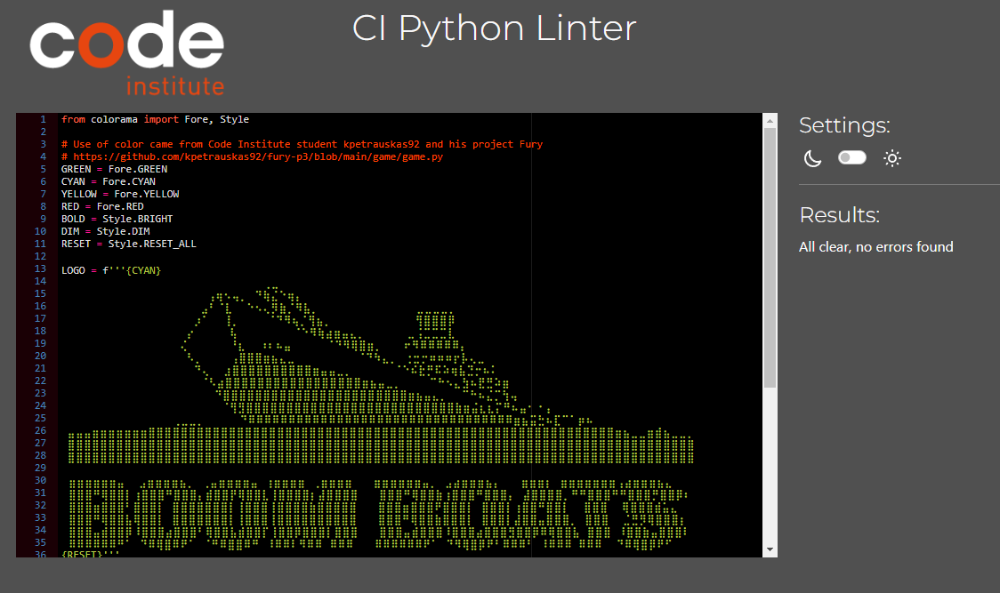

# Testing

## CI Linter validation
Each file passed through the [CI Python linter](https://pep8ci.herokuapp.com/) without any issues.

### Run game

### Run

### Settings

### Art

## Feature testing

### Loading screen

- [x] Logo displaying as intended
- [x] Typewriting effect for loading text
- [x] Automatically continues to main menu

- [x] FEATURE WORKS AS INTENDED

### Main menu

- [x] All visuals displaying as intended
- [x] Typewriting effect for loading text
- [x] Automatically continues to main menu

- [x] FEATURE WORKS AS INTENDED