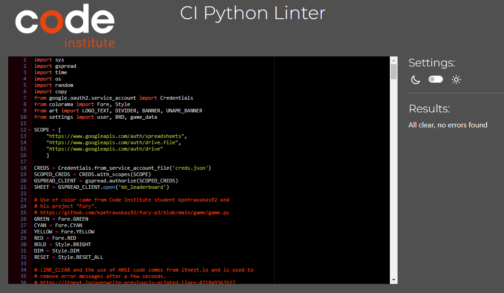
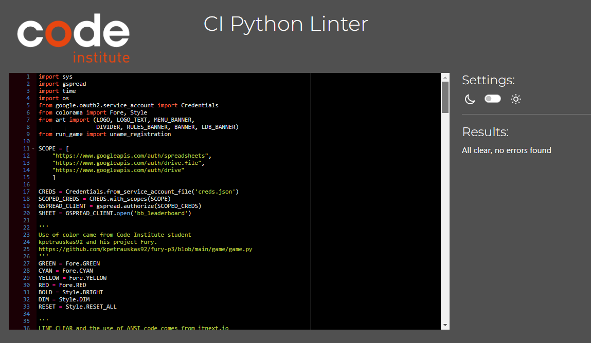
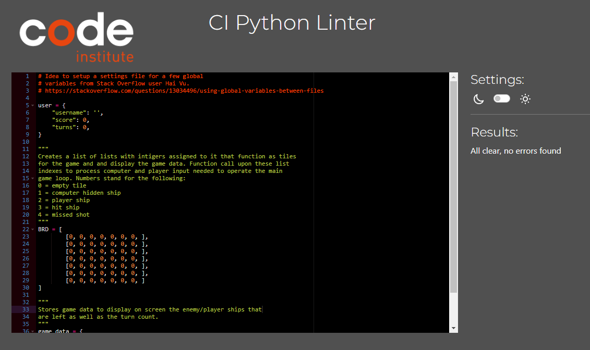
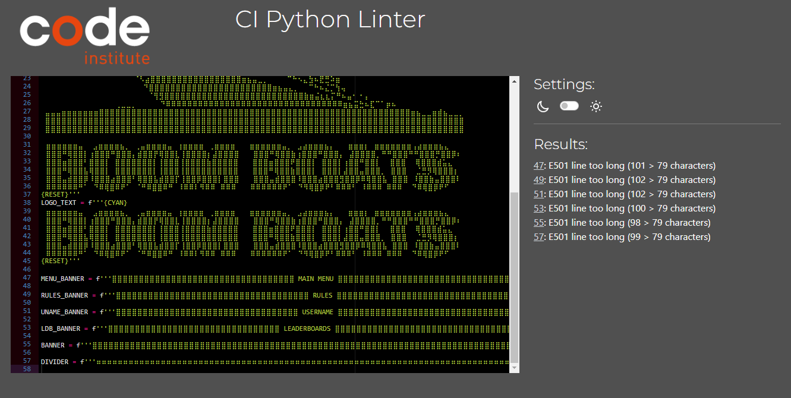
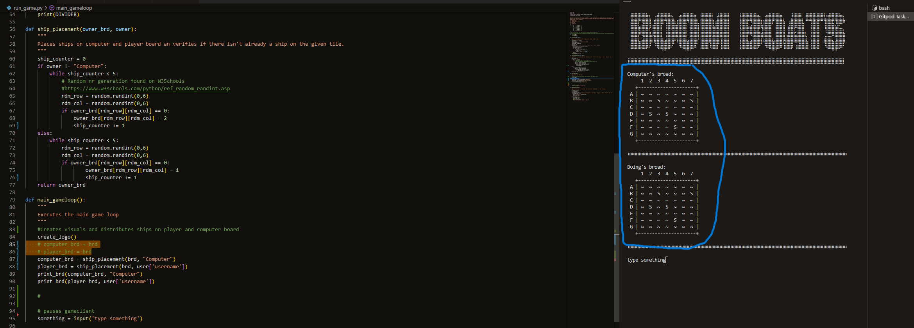
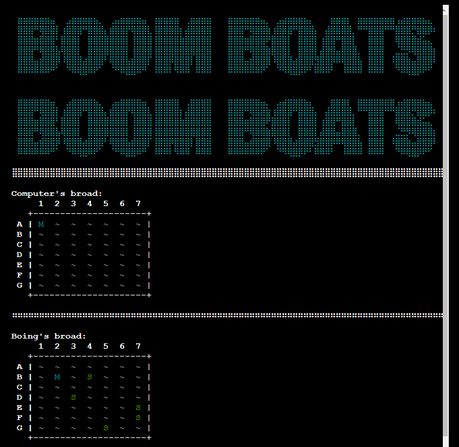

# Testing

## CI Linter validation
Each file except "Art" passed through the [CI Python linter](https://pep8ci.herokuapp.com/) without any issues.

### Run game

### Run

### Settings

### Art
Although an active effort was made to remove any error from the linter, the art linter check still displays 6 errors which were chosen to be ignored to maintain readability of the file and UI integrity of the game. The character limit is exceeded because the design choice was made to have banners and artwork span the entire width of the screen. In a future projects I will make certain the art choices do not intefere with Python Code style standarts.

[Back to top](<#testing>)

## Feature testing

### Loading screen

- [x] Logo displaying as intended.
- [x] Typewriting effect for loading text.
- [x] Automatically continues to main menu.

**FEATURE WORKS AS INTENDED**

### Main menu

- [x] All visuals displaying as intended.
- [x] Errors display correctly for invalid inputs.
- [x] Errors are cleared from screen after a few seconds.

**FEATURE WORKS AS INTENDED**

### Quit

- [x] Confirmation request pops up open choosing quit.
- [x] Errors display correctly for invalid inputs and returns user to main menu.
- [x] Errors are cleared from screen after a few seconds.
- [x] Instruction is displayed on how to reboot programme after quitting.
- [x] Terminates the game.

**FEATURE WORKS AS INTENDED**

### Leaderboards

- [x] All visuals displaying as intended.
- [x] Correctly retreives all data from the leaderboards worksheet.
- [x] Orders highscores from highest to lowest.
- [x] Displays top 10 scores on the leaderboards
- [x] Displays instruction on how to return to menu/user registration based on the origin of the user. 

**FEATURE WORKS AS INTENDED**

### Rules

- [x] All visuals displaying as intended.
- [x] Displays instruction on how to return to menu/user registration based on the origin of the user. 

**FEATURE WORKS AS INTENDED**

### Play Game

- [x] All visuals displaying as intended.
- [x] Asks user if they want to view the rules and employs correct error handeling for any invalid inputs.
- [x] Errors are cleared from screen after a few seconds.
- [x] Brings user to rules screen if yes is chosen.
- [x] Proceeds to user registration if no is chosen.
- [x] Displays instruction on how to return to menu/user registration based on the origin of the user. 

**FEATURE WORKS AS INTENDED**

### User registration

- [x] All visuals displaying as intended.
- [x] Asks user if they want toinput a username and employs correct error handeling for any invalid inputs. (<3 or >10 chracters, empty inputs and only whitespace)
- [x] Errors are cleared from screen after a few seconds.
- [x] Brings user to the game upon receiving a valid username.
- [x] Stores the username in the user's data.

**FEATURE WORKS AS INTENDED**

### Main game screen

- [x] All visuals displaying as intended, including the username stred in the user's data above the player board.
- [x] All visuals update as intended after processing player & computer strike targets.
- [x] Correctly displays and updates the informative UI elements for scoring, turn count, and player/computer ships that are intact.
- [x] Instructions visible on screen and error handeling for invalid inputs work correctly.
- [x] Errors are cleared from screen after a few seconds.
- [x] Computer turn shows decision making process.
- [x] Displays Victory/Defeat message upon player or computer ships reaching 0.
- [x] Shows the bonus points awarded to the player.
- [x] Prints total score for that run to the screen, including confirmation data is send to the leaderboard.
- [x] Correctly updates the leaderboard.
- [x] Asks user if they want to play again and has correct error handeling for invalid inputs.
- [x] Refreshes game and game data upon choosing to restart, without clearing the username.
- [x] Brings user back to main menu if no is chosen/

**FEATURE WORKS AS INTENDED**

[Back to top](<#testing>)

## Known bugs and issues

### Resolved

#### Duplicate boards after ship placement
When placing ships for the player and computer both would end up with an identical board. The bug was caused due to the computer_brd and player_brd copying a reference to the BRD list as opposed to comying the actual board themselves. Changes made to the boards would then be reflected in both variables. The issue was resolved by adding a copy.deepcopy statement for BRD to actually copy the list of lists as opposed to the reference to it. 

#### Rows and columns switched
During earlier stages of the devlopment rows and columns were switched around when user input their strike coords. Causing unintended strike targets. The solution turned out to be the fix of a coding arror in the validate_hit function where rows and columns were switched around. 

### Unresolved

#### Incorrect screen clearing
The code os.system('clear') that is supposed to clear the entire screen does not work entirely as it is supposed to n the mock-terminal. When multiple lines are skipped, causing multiple error messages to pop up, the clear_screen function only clears the lines currently visible on the screen. The lines that you can see when you scroll up remain as they are. When new visuals are printed to the screen however, the mock terminal does "focus" on the newly printed lines. So, unless the user scrolls up this issues won't intefere with the user experience or flow of the game. 

This issue has been taken up with Code Institute Student support who could confirm other students have encountered the same issue but without any definitive solution. When the game is run in the console of a programme like Gitpod the clear_screen function works as intended.

[Back to top](<#testing>)